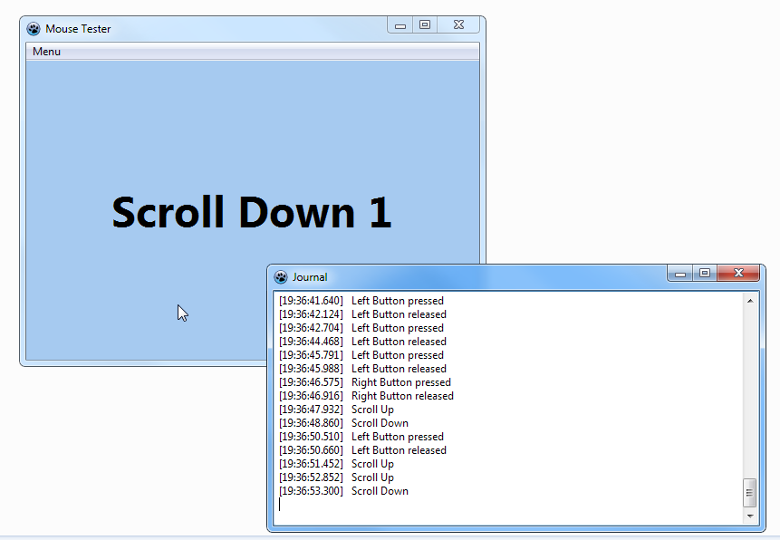

# Mouse Tester
Small tool for testing mouse clicks and scroll. It can help you detect double-clicks and accidental roll back of mouse wheel. 

# How to use

Simply move mouse cursor to program window and press buttons or scroll. In addition you can open journal of mouse events.

# Download

[Download for Windows](https://github.com/artem78/MouseTester/releases/latest)

# ToDo

- [x] Show warnings if false double clicks detected
- [x] Port to Linux
- [ ] Add more translations
- [ ] Make icon
